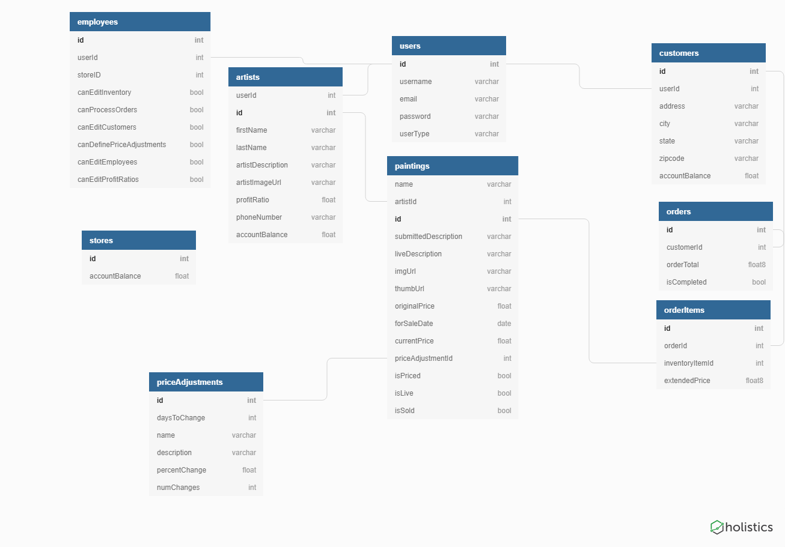

# FineConsign

While most eCommerce platforms are designed for direct sales and repeatable items, they are not well-suited to consignment stores.  FineConsign is purpose-built for your consignment store operation!

## Goals for user types

### Customers:
- [x] Potential customers should be able to view the current items for sale without requiring a login.
- [ ] A customer should be able to create an account enabling them to "buy" a painting (pay with "exposure bucks!").
- [ ]	Ability to review current account balance from purchased items.

### Artists:
- [ ]	Ability to register an account as a "customer" and request store admins to update to an artist account.
- [ ] Once approved, artists should be able to create a profile, save the draft, and submit for admin review.
- [x] Artists can also create a page about paintings they are consigning with the store, save drafts, and submit for review.
- [ ] Ability to review current account balance from paintings sold.

### Employees (depending on permissions):
- [ ] The site administrator should have controls enabling employees varying levels of permissions.
- [ ]	Ability to assign prices and approve artist-submitted paintings for live viewing on the customer-facing site.
- [ ]	Ability to process customer orders in-store/online and credit the artist's account appropriately.
- [ ]	Ability to define automatic price reduction logic for aged inventory and create lists for marking down prices on the physical items in-store.

### Administrators:

- [ ]	In addition to all employee actions, Administrators should be able to edit and delete users of all types, and assign access rights to individual employees.
- [ ]	Ability to view store's account balance

## Entity Relationship Diagram:

## Personal goals:
*	Demonstrate knowledge of React, React styling libraries, and database design.
*	Create an app that has practical real-world application.
*	Potentially deploy live application for my aunt's non-profit painting guild that uses a similiar sales model.

## Technology needed:
*	ReactJS
*	JavaScript
*	Semantic UI for ReactJS
*	Firebase image hosting
*	JSON server

### APIs used: None

## MVP:
- [x]	Artists can submit items for potential consignment, and view items currently available for sale.
- [ ]	Employees can review submitted items, assign a price, and approve submissions which will cause the submission to be listed as available for sale.  Employees can also CRUD items available for sale.
- [ ]	Administrators can CRUD all endpoints.
- [x]	Firebase image hosting for artist/employee upload capability.

## Stretch goals:
- [ ]	Mock Order checkout functionality and customer account management.
- [ ]	Varying employee access rights.
- [ ]	Authentication with Firebase.

## Late additions to Roadmap (may require new database tables):
* Give customers the ability to save a painting as a favorite
* Give customers the ability to review artists' work.

***

This project was bootstrapped with [Create React App](https://github.com/facebook/create-react-app).

## Available Scripts

In the project directory, you can run:

### `npm start`

Runs the app in the development mode. 
Open [http://localhost:3000](http://localhost:3000) to view it in the browser.

The page will reload if you make edits. 
You will also see any lint errors in the console.

### `npm test`

Launches the test runner in the interactive watch mode. 
See the section about [running tests](https://facebook.github.io/create-react-app/docs/running-tests) for more information.

### `npm run build`

Builds the app for production to the `build` folder. 
It correctly bundles React in production mode and optimizes the build for the best performance.

The build is minified and the filenames include the hashes. 
Your app is ready to be deployed!

See the section about [deployment](https://facebook.github.io/create-react-app/docs/deployment) for more information.

### `npm run eject`

**Note: this is a one-way operation. Once you `eject`, you can’t go back!**

If you aren’t satisfied with the build tool and configuration choices, you can `eject` at any time. This command will remove the single build dependency from your project.

Instead, it will copy all the configuration files and the transitive dependencies (Webpack, Babel, ESLint, etc) right into your project so you have full control over them. All of the commands except `eject` will still work, but they will point to the copied scripts so you can tweak them. At this point you’re on your own.

You don’t have to ever use `eject`. The curated feature set is suitable for small and middle deployments, and you shouldn’t feel obligated to use this feature. However we understand that this tool wouldn’t be useful if you couldn’t customize it when you are ready for it.

## Learn More

You can learn more in the [Create React App documentation](https://facebook.github.io/create-react-app/docs/getting-started).

To learn React, check out the [React documentation](https://reactjs.org/).

### Code Splitting

This section has moved here: https://facebook.github.io/create-react-app/docs/code-splitting

### Analyzing the Bundle Size

This section has moved here: https://facebook.github.io/create-react-app/docs/analyzing-the-bundle-size

### Making a Progressive Web App

This section has moved here: https://facebook.github.io/create-react-app/docs/making-a-progressive-web-app

### Advanced Configuration

This section has moved here: https://facebook.github.io/create-react-app/docs/advanced-configuration

### Deployment

This section has moved here: https://facebook.github.io/create-react-app/docs/deployment

### `npm run build` fails to minify

This section has moved here: https://facebook.github.io/create-react-app/docs/troubleshooting#npm-run-build-fails-to-minify
